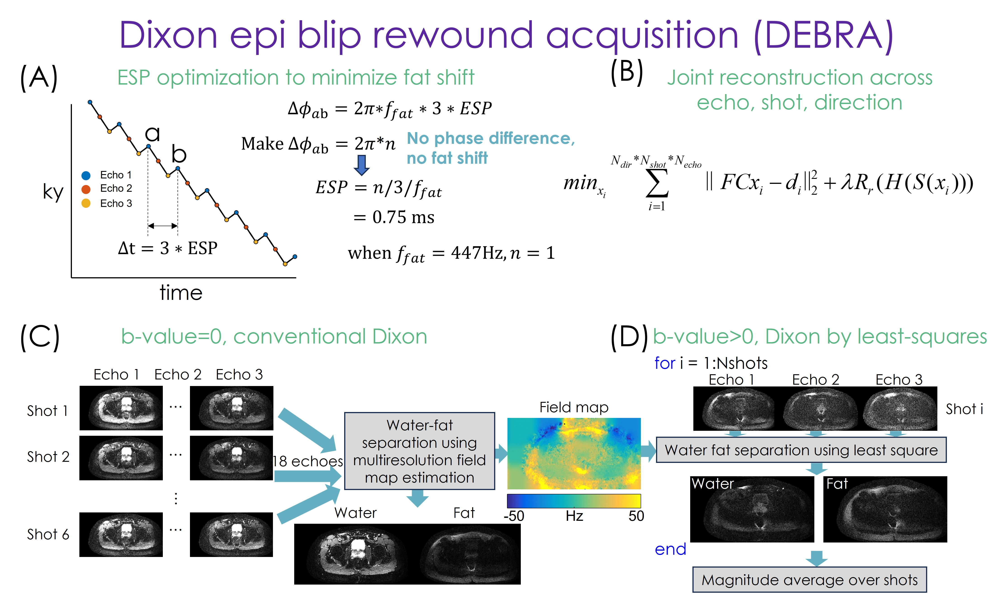

# debra
View the pulseq sequence at https://bughht.github.io/seqeyes_plugin/?url=https://github.com/xingwangyong/debra/blob/main/debra.seq . The sequence starts with a short GRE acquisition for sensitivity map calculation. Then the real EPI imaging readout starts. The EPI readout has three shots. The 1st is dummy, the 2nd is b-value=0, and the 3rd is b-value=1000s/mm2.

## Install
Step 2&3 is only needed for reconstruction
1. Download this repo. 
2. Download the following 3rd party tools
   - ISMRM water fat toolbox: http://cds.ismrm.org/protected/FatWater12_data/fwtoolbox_v1_code.zip
   - GE orchestra-sdk matlab
3. In `setuppath.m`, set the path to 3rd party toolboxes

## Usage
- `main_gen_sequence_brain_phantom.m`, generate the single shot pulseq sequence used for brain and phantom scan
- `main_recon.m`, recon the phantom data
